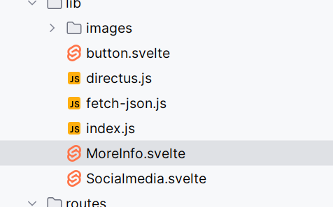

# hier vertel ik over wat ik geleerd heb in deze sprint

## mijn leervragen


**Ik wil beter worden in figma en designen hoe je zo'n ontwerp mooi kan maken** 
3.4.2 Schetst om gedachten en processen te verkennen, abstracte begrippen over te brengen en de oplossingsrichting inzichtelijk te maken.

**Ik wil beter worden in plannen waardoor mijn wiki en project gestructureerd is**
4.1.1 Richt projecten efficiënt en effectief in volgens de development-lifecycle en houdt rekening met de beschikbare tijd.


**Ik wil svelte leren kennen en weten hoe ik dit kan gebruiken**
3.1.2 Combineert onderbouwd principes, standaarden en best-practices op het gebied van 
frontend design en development om een oplossing voor een opdrachtgever te realiseren.

**Hoe haal je data uit een Headless CMS door middel van een framework te renderen in een website?**

**hoe lever je bewijslast goed in**

**hoe zorg ik dat mijn repository overzicheljk en goed navolgbaar is zonder wiki**


<h2>ga naar</h2> 
<a href="#geleerd1">dit heb ik geleerd</a>
<br>
<a href="#leerlogboek">dit heb ik gedaan</a>
<h2 id="leerlogboek">leerlogboek</h2>
<h3>2-9-2024</h3>
Ik heb mijn 1ste les dag gehad en daarin heb ik svelte geinstalleerd en een ontwerp gemaakt van de squadpage en een tutorial gevolgd van svelte


dit is een kleine samenvatting over svelte

Svelte: Een Compilerende Componentenframework
Scoped Styling: Elke component heeft zijn eigen CSS-scope, waardoor stijlen niet conflicteren tussen componenten.
Reactive State: Veranderingen in data worden automatisch weerspiegeld in de DOM, zonder dat je handmatig DOM-manipulatie hoeft te doen.
CSR (Client-Side Rendering): De applicatie wordt volledig in de browser gerenderd, waardoor interactieve gebruikerservaringen mogelijk zijn.
Compiler: Svelte compileert je componenten naar efficiënte JavaScript-code, waardoor de runtime overhead minimaal is.


dit gaat over sveltekit
SvelteKit: Een Metaframework Gebouwd op Svelte
SSG, MPA, AMD, SPA, SSR: SvelteKit ondersteunt verschillende renderingsstrategieën, waaronder Static Site Generation (SSG), Multi-Page Applications (MPA), en Server-Side Rendering (SSR).
Folder-Based Routing: Je definieert routes door het aanmaken van mappen en bestanden in je projectstructuur.
Data Fetching: SvelteKit maakt het eenvoudig om data op te halen van servers via GET en POST requests.
Code Splitting: Code wordt slim verdeeld over client en server, waardoor de initiële laadtijd van je applicatie wordt verminderd.
Hydration: SvelteKit kan server-rendered HTML "hydrateren" om een volledig interactieve client-side applicatie te creëren.
SSR Only Mode: Je kunt je applicatie volledig server-side renderen, wat ideaal is voor SEO en voor gebruikers met JavaScript uitgeschakeld.


````sveltehtml
 npm create svelte@latest
                     npm install
                     npm run dev
                    npm install @directus/sdk
````


<h3>3-9</h3>
Ik heb verder de tutorial gevolgd en 
ik heb gekeken naar hoe ik mijn project kan deployen op vercel en dat is gleukt dankzij deze link https://vercel.com/docs/frameworks/sveltekit


<h3>4-9</h3> ik heb verder de tutorial gevolgd en een schets gemaakt voor mijn profilecard en ik heb op vercel deze tutorial gevonden en dit heeft mij enorm geholpen in het begrijpen van sveltekit
https://vercel.com/docs/beginner-sveltekit

ophalen data met directus

````javascript


export default async function fetchJson(url, payload = {}) {
  return await fetch(url, payload)
    .then((response) => response.json())
    .catch((error) => error)
}

````

<p>dit zijn aantekingen over svelte en sveltekit</p>


Svelte: Een Compilerende Componentenframework
    Scoped Styling: Elke component heeft zijn eigen CSS-scope, waardoor stijlen niet conflicteren tussen
    componenten.
    <br>
    Reactive State: Veranderingen in data worden automatisch weerspiegeld in de DOM, zonder dat je handmatig
    DOM-manipulatie hoeft te doen.
    <br>
    CSR (Client-Side Rendering): De applicatie wordt volledig in de browser gerenderd, waardoor interactieve
    gebruikerservaringen mogelijk zijn.
    <br>
    Compiler: Svelte compileert je componenten naar efficiënte JavaScript-code, waardoor de runtime overhead
    minimaal
    is.

   installeren svelte
<pre><code class="">
            npm create svelte@latest
             npm install
             npm run dev
            npm install @directus/sdk
        </code></pre>

<p>ophalen data uit de databse

fetch json file

````javascript
export default async function fetchJson(url, payload = {}) {
  return await fetch(url, payload)
    .then((response) => response.json())
    .catch((error) => error)
}


````


in de page.server.js
````javascript
import fetchJson from "$lib/fetch-json.js"

export async function load() {
	// const url = 'https://fdnd.directus.app/items/person/?filter={"squad_id":3}'
	const url = 'https://fdnd.directus.app/items/person/9'
	const persons = await fetchJson(url)
	return {
		persons: persons.data
	}
}

````

op de +page.svelte
````sveltehtml

 <h1>{data.persons.name}  {data.persons.prefix}  {data.persons.surname}</h1>
            <picture>
                <source
                        srcset="{data.persons.avatar}?format=webp"
                        type="image/webp"

                />
                <source
                        srcset="{data.persons.avatar}?format=avif"
                        type="image/avif"
                />

                
            </picture>
            <section class="animationfade">
                <h2>Over mij</h2>
                <p> Leeftijd: 20</p>
                <p>{data.persons.bio}  </p>
                <p>Op dit moment doe ik de opleiding frontend design en development en zit ik in mijn
                    afstudeerjaar</p>
````

</p>
    <h4>sveltekit</h4>
    <p>
        SvelteKit: Een Metaframework Gebouwd op Svelte
        SSG, MPA, AMD, SPA, SSR: SvelteKit ondersteunt verschillende renderingsstrategieën, waaronder Static Site
        Generation
        <br>
        (SSG), Multi-Page Applications (MPA), en Server-Side Rendering (SSR).
        Folder-Based Routing: Je definieert routes door het aanmaken van mappen en bestanden in je projectstructuur.
        Data Fetching: SvelteKit maakt het eenvoudig om data op te halen van servers via GET en POST requests.
        <br>
        Code Splitting: Code wordt slim verdeeld over client en server
    </p>


<h3>5-9</h3> ik heb mijn profilecard in code uitgewerkt en het button component gemaakt voor de squad page en dit is gelukt met behulp van de tutorial




<h3>6-9</h3> ik heb geleerd hoe ik netjes issues kan inschieten en feedback kan
geven waardoor eerstejaars beter begrijpen hoe ze naar de oplossing kunnnen werken


