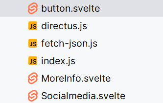

 <h2 id="week2">week2</h2>
 <ul>
     <li>ga naar <a href="#geleerd2">wat heb ik geleerd</a></li>
 </ul>


<h2>leerlogboek</h2>
<h2>10 september</h2>
heb ik een workshop over figma gekregen en hebben we simpele oefeningen gedaan die we moeten na maken 


verder hebben we het ook gehad over componeneten en de basisstof van figma zoals auto layout en compononetnen hoe je kleuren en buttons kan herbruiken 
In de les heb ik ook geprobeerd om zo'n kaartje na te maken met grid en hoe je dit kan positioneren 


en ik heb vandaag geleerd hoe ik de connectie met de database maak en iedereen kan laten zien en als je klikt op 1 naam dat je naar de profilecard gaat
dit is de code in de +page.js

```
import fetchJson from "$lib/fetch-json"

export async function load() {
	const url = 'https://fdnd.directus.app/items/person/?filter={"squad_id":3}'
	const squadD = await fetchJson(url)

	const url1 = 'https://fdnd.directus.app/items/person/?filter={"squad_id":4}'
	const squadE = await fetchJson(url1)

	const url2 = 'https://fdnd.directus.app/items/person/?filter={"squad_id":5}'
	const squadF = await fetchJson(url2)

	// iedereen
	const everyone = 'https://fdnd.directus.app/items/person/'
	const persons = await fetchJson(everyone)


	return {
		persons: persons.data,
		squadD: squadD.data,
		squadE: squadE.data,
		squadF: squadF.data
	}
}
export let csr = false;
```

dit is de code in svelte 
```
<ul>
    {#each data.squadD as person}
        <li>
            <a href="/{person.id}">


                {person.name}
            </a>
        </li>
    {/each}
</ul>
```

verder hebben we die dag ook inspiratie opgedaan en de papieren schetsen gebropeerd uit te werken in figma 

inpsiratie


de papieren schets  <br>


mijn uitwerking van de papieren schets
<br>


ik heb een basisopzet gemaakt voor de squadpage
 zie de link https://github.com/KaanKalmi/your-tribe-for-life-squad-page/tree/squadpage2.2-yujing
ophalen data uit de database

 ````javascript
import fetchJson from "$lib/fetch-json"

export async function load() {
	// klassen vorig jaar
	const url = 'https://fdnd.directus.app/items/person/?filter={"squad_id":3}'
	const squadD = await fetchJson(url)

	const url1 = 'https://fdnd.directus.app/items/person/?filter={"squad_id":4}'
	const squadE = await fetchJson(url1)

	const url2 = 'https://fdnd.directus.app/items/person/?filter={"squad_id":5}'
	const squadF = await fetchJson(url2)

	// klassen dit jaar
	const squad= 'https://fdnd.directus.app/items/squad/?filter={%22tribe_id%22:2}'
	const newsquad = await fetchJson(squad)

	// iedereen
	const everyone = 'https://fdnd.directus.app/items/person/'
	const persons = await fetchJson(everyone)


	return {
		persons: persons.data,
		squadD: squadD.data,
		squadE: squadE.data,
		squadF: squadF.data,


		// dit is als de nieuwe klas toegevoegd word
		// https://fdnd.directus.app/items/person/?filter={%22squad_id%22:6}
		newsquad: newsquad.data

	}
}
````

````sveltehtml

<ul>
    {#each data.squadD as person}
        <li>
            {#if person.avatar}
                
            {:else}
                
            {/if}
            <div>
                <a href="/{person.id}">


                    {person.name}
                </a>
                <span>klas : {person.squad_id}</span>
                <ButtonComponent>

                </ButtonComponent>

            </div>

        </li>
    {/each}
</ul>
````
en ik heb aan mijn visitekaartje gewerkt
daarin heb ik een voorbeeld gevonden hoe ik mooi effect kan geven aan een hover
https://codepen.io/twhite96/embed/brryVq?height=600&default-tab=result&embed-version=2#result-box

ook heb ik gekeken naar hoe ik tekst kan laten verschijn na 2 seconden zie hier de code pen
https://codepen.io/hubspot/embed/ExWxByR?height=384.6151123046875&theme-id=39533&default-tab=css%2Cresult&slug-hash=ExWxByR&editable=true&user=hubspot&name=cp_embed_2#result-box

<br>
en ik heb 3 componenten gemaakt en toegepast in mijn visitekaartje waardoor ik meer overicht heb 
welke code ik gebruik en waar welke styling van is



zie de components
<ul><li><a href="https://github.com/yujing-student/your-tribe-for-life-profile-card/blob/animation/src/routes/MoreInfo.svelte">moreinfo</a></li>
<li>
<a href="https://github.com/yujing-student/your-tribe-for-life-profile-card/blob/animation/src/routes/Socialmedia.svelte">socialmedia</a>
</li>
<li>
<a href="https://github.com/yujing-student/your-tribe-for-life-profile-card/blob/animation/src/routes/button.svelte">button</a>
</li>
</ul>

importern van de buttons is simpel dit staat in je script
````
    export let data;
    import Moreinfo from '$lib/MoreInfo.svelte';
    import ActionButton from '$lib/button.svelte';
    import SocialMedia from '$lib/Socialmedia.svelte';
````


hier roep je de componenten aan 
````
   <section class="animationfade">
                <h2>Over mij</h2>
                <p> Leeftijd: 20</p>
                <p>{data.persons.bio}  </p>
                <p>Op dit moment doe ik de opleiding frontend design en development en zit ik in mijn
                    afstudeerjaar</p>
            </section>
            <SocialMedia/>
            <ActionButton/>
            <Moreinfo/>
````

<h2>11 september</h2>
We hebben les gehad in creative coding hoe je met svelte javascript kan gebruiken en hoe je 
animaties kan gebruiken in svelte en ik lees de documentatie van svelte
https://svelte.dev/docs/svelte-transition

Ook weet ik nu waarom mijn javascript niet werkt en ik 1st een error had omdat 
ik csr = false had in mijn code en dit moet csr = true zijn waardoor je de static map kan gebruiken
ook moet je onmount installeren voor svelte en daarvoor heb ik dit gelezen zodat ik beter begrijp wat het doet en waarom je het nodig hebt :https://learn.svelte.dev/tutorial/onmount


<h3>we love web vasilis van gemert op 13 september</h3>
principal frontender dit is zijn linkedin profiel:https://www.linkedin.com/in/vasilis-van-gemert-360627158/?originalSubdomain=nl
vakdocent cmd

hij was vroeger een kunstunaar 
het nut van onzin maken is dat je er inspiratie op kan doen en op zijn website staan er voorbeelden https://vasilis.nl
hij heeft voor een master een opdracht gehad en daar heeft die een pagina gemaakt en ingeleverd en dat was dit werk:https://vasilis.nl/flipping-things/

gebruik je creativiteit en maak gekke dingen daar kan je veel van leren 

maak een website niet alleen toegankelijk in theorie maar ook in de pratijk zodat het ook echt bruikbaar is en niet dat je er achteraf achter komt
er word gebruik gemaakt van screenreaders en een screenreader is ook ingewikkeld als je het nog niet kent 
een gebruiker krijgt te horen heading 2 en dat kan verwarrend zijn
een website die je zelf maakt moet je altijd zelf testen met een screenreader zodat je weet hoe het voor een ander is 


<h2 id="geleerd2">dit heb ik geleerd</h3>
<h4>figma workshop</h4>
<p>
ik heb een workshop over Figma gevolgd. Tijdens deze workshop hebben we eenvoudige oefeningen gedaan die we
moesten namaken. We hebben ook geleerd over componenten en de basisprincipes van Figma, zoals auto layout en
hoe je kleuren en buttons kunt hergebruiken.


 </p>
 <p>In de les heb ik geprobeerd om een kaartje na te maken met
     behulp van een grid en geleerd hoe je dit kunt positioneren.

 
 </p>

<p>
	ook heb ik all mijn schetsen in figma gemaakt zie hier de issue die ik heb aangemaakt:  https://github.com/yujing-student/your-tribe-for-life-profile-card/issues/24
</p>

 
 <h4>creative coding csr</h4>
 <p>
     ik heb een workshop gehad over creative coding en hoe je met css leuke animaties kan maken en hoe ik met
     ingebouwde
     svelte transitions een animatie kan toevoegen aan mijn visitekaartje <a
         href="https://svelte.dev/docs/svelte-transition">link naar svelte documentatie
 </a>
 

 </p>
 <p>
     verder heb ik ook les gehad in wat csr is en wat het doet en csr staat voor clientside rendering
     en daarmee staat client side javascript aan en je moet onmount isntalleren zodat je javascript code kan
     gebruiken want
     onMount  is een lifecycle method dat uitgevoerd word nadat een component is rendered naar de dom
     als dat renderen niet gebruikt dan krijg je een error queryselctor is not defined

  zie deze issue waar ik het probleem beschhrijf en de oplossing https://github.com/yujing-student/your-tribe-for-life-profile-card/issues/15
 </p>

 <h4>ophalen data uit de datbase code snippet</h4>
  ik heb  geleerd hoe ik een verbinding met de database kan maken en hoe ik iedereen kan
   laten zien. Als je op een naam klikt, ga je naar de profielkaart. Hier is de code die ik heb gebruikt in de
   +page.js:
 
  ````javascript

import fetchJson from "$lib/fetch-json"

export async function load() {
	// klassen vorig jaar
	const url = 'https://fdnd.directus.app/items/person/?filter={"squad_id":3}'
	const squadD = await fetchJson(url)

	const url1 = 'https://fdnd.directus.app/items/person/?filter={"squad_id":4}'
	const squadE = await fetchJson(url1)

	const url2 = 'https://fdnd.directus.app/items/person/?filter={"squad_id":5}'
	const squadF = await fetchJson(url2)

	// klassen dit jaar
	const squad= 'https://fdnd.directus.app/items/squad/?filter={%22tribe_id%22:2}'
	const newsquad = await fetchJson(squad)

	// iedereen
	const everyone = 'https://fdnd.directus.app/items/person/'
	const persons = await fetchJson(everyone)


	return {
		persons: persons.data,
		squadD: squadD.data,
		squadE: squadE.data,
		squadF: squadF.data,


		// dit is als de nieuwe klas toegevoegd word
		// https://fdnd.directus.app/items/person/?filter={%22squad_id%22:6}
		newsquad: newsquad.data

	}
}
````

````sveltehtml

<ul>
    {#each data.squadD as person}
        <li>
            {#if person.avatar}
                
            {:else}
                
            {/if}
            <div>
                <a href="/{person.id}">


                    {person.name}
                </a>
                <span>klas : {person.squad_id}</span>
                <ButtonComponent>

                </ButtonComponent>

            </div>

        </li>
    {/each}
</ul>
````

<h4>componententen</h4>


importern van de buttons is simpel dit staat in je script
````
    export let data;
    import Moreinfo from '$lib/MoreInfo.svelte';
    import ActionButton from '$lib/button.svelte';
    import SocialMedia from '$lib/Socialmedia.svelte';
````


hier roep je de componenten aan 
````
   <section class="animationfade">
                <h2>Over mij</h2>
                <p> Leeftijd: 20</p>
                <p>{data.persons.bio}  </p>
                <p>Op dit moment doe ik de opleiding frontend design en development en zit ik in mijn
                    afstudeerjaar</p>
            </section>
            <SocialMedia/>
            <ActionButton/>
            <Moreinfo/>
````


[//]: # (gevonden op daily dev)
[//]: # (https://skillivo.in/css-rotate-property-explained-5/ )

[//]: # (https://skillivo.in/css-translate-property-guide/?ref=dailydev)


